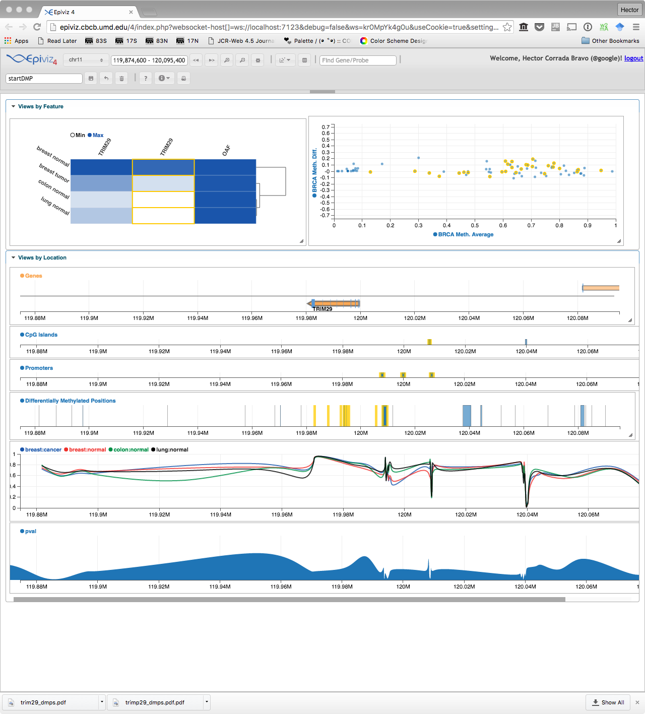

  
```{r setup, include=F}
knitr::opts_chunk$set(cache=TRUE)
```
   
## Introduction

The purpose of this workshop is to serve as a guide for analyzing 450k Illumina Human Methylation data to find differences in methylation at the base pair, and region levels. We will use previous research findings of differentially methylated locations, the TRIM29 gene and other transcription regulators between various solid tissue samples, including breast (BRCA), and colon (COAD), and lung (LUSC), and between normal and tumor breast (BRCA) samples are observed as guide. 

We will use mainly the `minfi` and `epivizr` packages in Bioconductor. The `minfi` package is used to identify differentially methylated positions, regions, and blocks. The `epivizr` package is used to serve data generated in R to an Epiviz interactive visualization workspace. This protocol aims to walk through the analysis and visualization of Illumina Infinium Human Methylation 450k data from the Cancer Genome Atlas (TCGA) project.

Here is the general process to be followed:  


## Motivation

#### Tissue Specific DNA Methylation in Normal Human Breast Epithelium and in Breast Cancer (Avraham et al., 2014)     

Research findings from Avraham et al. in 2014 conclude that the TRIpartite Motif-containing 29 (TRIM29), also called the ataxia telangiectasia group D-complementing (ATDC), has differing functions in various cancer types. In breast cancer, the expression of TRIM29 is less than the expression in normal breast tissue, and it acts as a tumor suppressor. The promoter of the gene is hypo-methylated in normal breast tissue, but hyper-methylated in other normal tissues, like the colon, lung, and endometrium, where it is oncogenic. In tumor breast tissues, the methylation increased and expression decreased when compared with normal breast tissues. In comparisons between other cancer types and their respective normal tissues, the opposite methylation pattern was observed^1^.   

The researchers identified 110 genes that were differentially methylated in the breast compared to all other epithelial tissues tested. Of these 110 genes, a group 15 of them were DNA binding and transcription regulators, which were found to have a notable relevance to cancer. Their analysis of TCGA data for these genes, including ALX4, GATA5, MGMT, NEUROG1, SOX10, SREBP1, ST18, TRIM29, and TP73, revealed methylation differences at most of the corresponding loci between normal and tumor breast samples. The methylation pattern also varied between breast cancer types, including basal, luminal-A and luminal-B, and between different normal tissue types, identifying these gene regions as differentially methylated regions (DMRs). The TRIM29 gene has a CpG island at the transcription start site of the gene (between 120,008,000 and 120,009,000 on chromosome 11)^1^. 

In breast tissues, it was found that this CpG island was hypo-methylated methylation, and in other tissues, including colon and lung, it has full methylation. These results were found analyzing Illumina-Infinium HumanMethylation27 array data.  TRIM29 expression was higher in normal breast tissues than in other normal tissues tested. The main conclusion proposed by authors was that, "Epigenetic alterations affecting tissue-specific differentiation are the predominant mechanism by which epigenetic changes cause cancer^1^." 
In this protocol we will recapitulate some of these findings and use interactive visualization to explore additional findings in this data.

## Gathering and Preprocessing Data

The data used in this protocol is 450k Illumina Human Methylation data from the Cancer Genome Atlas (TCGA) project. In order to analyze the data and prepare it for visualization in Epiviz, it must first be loaded into R. We use four different types of 450k samples, as shown in the chart below, so that methylation analyses could be done between the three normal samples and the normal and tumor BRCA samples, separately.

Cancer Type | Tissue | # Normal Samples | # Tumor Samples
----------- | ------ | ---------------- | -------------
BRCA        | breast | 15               | 15
COAD        | colon  | 15               | 0
LUSC        | lung   | 15               | 0

The accompanying vignette `data_preprocessing.Rmd` contains information on how to download and
preprocess data used in this workshop. The end result are objects in classes defined by `minfi`:

Data Input             | Processing Function    | Output           | 
---------------------- | ---------------------- | ---------------- | 
Raw data (IDAT files)  | `read.450k.exp`        | RGChannelSet     | 
RGChannelSet           | `preprocessIllumina`   | MethylSet        | 
MethylSet              | `mapToGenome`          | GenomicMethylSet | 
GenomicMethylSet       | `ratioConvert`         | GenomicRatioSet  | 

For this workshop we have subsetted these to chromosomes 10, 11 and 20:

```{r}
data(meth_set)
data(gm_set)
data(gratio_set)

meth_set
gm_set
gratio_set
```

## DMP Visualization

### Epiviz workspaces and hosted data

For this analysis we will display our analysis data along with contextual data hosted on
servers at the University of Maryland including gene annotation, CpG Island locations and gene expression from the Gene Expression Barcode project. These pre-existing workspaces are similar to those from Timp et al. in 2014 that included visualizations of large hypo-methylated blocks^2^ available at [http//epiviz.github.io/timp2014](http//epiviz.github.io/timp2014). We'll start by exploring a couple of those to get a sense of the type of visualizations and analyses we can perform.

We have created workspaces you can use for this workshop. Of course, you can also create your own following these steps:

* Open the epiviz app [http://epiviz.cbcb.umd.edu](http://epiviz.cbcb.umd.edu)   
* Login into the app (you can use one of a number of authentication options)
* Add the genes track, CpG Islands track, and gene expression heatmap
* Type the chosen name of the workspace in space that reads "Save Workspace Name" and click "Save Workspace" button

Your workspace will now be saved under your account and will be accessible by others as the URL is specific to each workspace (e.g. `http://epiviz.cbcb.umd.edu/?ws=<workspace_id>`). The final workspace should look similar to this:

  

### Starting epivizr session 

We can now start an epiviz connection to the workspace with hosted data to which we can
add plots as we do our analysis. Start the epiviz workspace we provide (or the one you created yourself) 

```{r,eval=F}
library(epivizr)
app <- startEpiviz(workspace="kr0MpYk4g0u",try_ports=TRUE)
```

If you created your own workspace, provide it's id as the `workspace` argument.

The `app` object serves as the interface between your R session and the epiviz
interactive visualization application. We can use it to obtain information about 
available charts, settings, the current location in view. We can also use it to 
navigate to specific genomic locations as well. We will see these during the course
of the workshop.

For example, to find out which chart types are available in the epiviz web app,
we can use the `app$chart_mgr$list_charts()` method.

#### Differentially methylated position (DMP) analysis

Minfi's main function to find differentially methylated positions is "dmpFinder". It uses single probe analysis on CpGs to find methylation differences and a t-test (or F-test) between two or more phenotype groups phenotypes to determine CpG positions that are differentially methylated (in this case between BRCA normal and tumor samples).

Before we do this analysis, we may want to add a track showing promoter regions for genes since we may want to distinguish DMPs that occur within promoters. We will use Bioconductor annotation infrastructure to do this.

```{r,eval=F}
library(GenomicFeatures)
library(TxDb.Hsapiens.UCSC.hg19.knownGene)
promoter_regions <- promoters(TxDb.Hsapiens.UCSC.hg19.knownGene,upstream=1000,
  downstream=200)
promoters_track <- app$plot(promoter_regions,datasource_name="Promoters")
```

The `promoters_track` object serves as the interface to the specific track we 
just added to the epiviz workspace. We can change track settings through the
object. Let's first find out settings that are available to modify for this track. To do so we use the `promoters_track$print_info()`.

Let's change the track color to distinguish it from the CpG track we added previously: `promoters_track$set(colors=c("#FFFFFF"))`

Now, we are ready to perform the minfi analysis.

```{r,eval=F}
library(doParallel)
cores <- detectCores()
registerDoParallel(cores)
meth_set_breast <- meth_set[,which(meth_set$Tissue=="breast")]
dmp <- dmpFinder(meth_set_breast,meth_set_breast$Status,type="categorical")
head(dmp)
```

Now we see the probes (CpG positions) that show differential
methylation along with associated statistics for them. Let's first add a track showing the location of these CpGs to our session. 
```{r, eval=FALSE}
dmp_gr <- granges(gm_set[rownames(dmp),])
dmps_track <- app$plot(dmp_gr,datasource_name="Differentially Methylated Positions")
```

In the epiviz app, you can use the hovering feature
to explore how DMPs spatially correlate to promoters, CpG Islands, or genes based on their expression from the heatmap.

Now let's plot methylation beta to see the measurement that gives rise to the statistical inferences we just plotted  across the genome for each tissue type and status. 

First, we calculate mean methylation for each group of samples

```{r,eval=F,results="hide"}
betas <- getBeta(gratio_set)
pd <- pData(gratio_set)
fac <- paste(pd$Tissue, pd$Status, sep=":")
sample_indices <- split(seq(len=nrow(pd)), fac)

mean_betas <- sapply(sample_indices, function(ind) rowMeans(betas[,ind]))
```

Now we have a matrix with mean methylation for each
group of samples which we will use to create our track. Let's create a `GRanges` object that maps each of these
values to the corresponding probes genomic location. Finally, add these values as a line track.

```{r, eval=FALSE}
cpg_gr <- granges(gm_set)
mcols(cpg_gr) <- mean_betas
beta_track <- app$plot(cpg_gr,datasource_name="Percent Methylation",type="bp", settings=list(step=1, interpolation="basis"))
```

Another useful track to plot for these DMPs is the p-value resulting from the statistical test. We will plot that as 
a `StackedLineTrack`. First, we add the p-value to the `GRanges` object we are using. 

```{r, eval=FALSE}
dmp_gr$pval <- -log10(dmp$pval)
```

This time, we are plotting things a bit differently. The `plot` method we have used so far does two things: first, it registers the data object we pass to it as a data source in epiviz, and then it adds a chart with the **default** chart type defined for that data type. 

An important part of the `epivizr` design is that data and plots are separated: you can make multiple charts from the same data object without having to replicate data multiple times. This way, when you navigate in the app data queries are made by data object, not per chart, which leads to a more responsive application. Also, this allows users to create charts that include data from both the R session and data hosted remotely.

So, since we will be using a "StackedLineTrack" which is not a default chart type, we need to do these two steps in order.

```{r,eval=F}
# first declare the GRanges object as a data source
gr_obj <- app$data_mgr$add_measurements(dmp_gr, "pvalues", type="bp", columns="pval")

# then add the track
pvals_track <- app$chart_mgr$visualize("StackedLineTrack", datasource=gr_obj)
```

Finally, let's add an MA plot of BRCA methylation to visualize how methylation differences are distributed across probes. We can of course do this in R by adding methylation
difference and average as additional columns to the "GenomicsRanges" object we are using. However, we can also exercise epiviz's "Computed Measurement" feature to do this.

* Use "Computed Measurements" to create plot with existing data with the x-axis showing the average methylation and the y-axis showing the difference in methylation between normal and tumor samples
* Further instructions for creating MA plots in Epiviz can be found here: epiviz.github.io/computed-measurements.html 

Now that we have added all of these tracks, let's navigate  to the TRIM29 gene location to check the results discussed above. You can zoom in to get a closer look at the methylation differences at the CpG island at the TRIM29 promoter.

```{r,eval=F}
app$navigate("chr11",119870000,120100000)
```

The ending DMP Visualization workspace should look like this:  
  

Let's close the connection to the epiviz app for the next section.

```{r, eval=FALSE}
app$stop_app()
```

## Differentially Methylated Region Analysis

Let's start from the same initial workspace as before.

```{r,eval=F}
app <- startEpiviz(workspace="kr0MpYk4g0u",try_ports=TRUE)
```

#### Analysis in R:

Let's add the promoter regions and average methylation tracks we added previously. 

```{r,eval=F}
promoter_track <- app$plot(promoter_regions, datasource_name="Promoters")
beta_track <- app$plot(cpg_gr, datasource_name="Percent Methylation", type="bp", settings=list(step=1, interpolation="basis"))
```

Next, use Minfi's bumphunter function to find differentially methylated regions, which are deviations in the methylation of relatively small CpG loci clusters at the gene promoter scale (1-2kb), between normal and tumor breast tissue. Bumphunting uses a cutoff value to determine the magnitude in methylation difference to identify differentially methylated regions (DMR).

```{r,eval=F,results="hide",message=F}
# first subset to breast samples
gratio_set_breast <- gratio_set[,which(gratio_set$Tissue=="breast")]

# make a design matrix to use with bumphunter
status <- pData(gratio_set_breast)$Status
mod <- model.matrix(~status)

# cluster cpgs into regions holding potential dmrs
gr <- granges(gratio_set_breast)
chr <- as.factor(seqnames(gr))
pos <- start(gr)
cl <- clusterMaker(chr, pos, maxGap=500)

# find dmrs
bumps <- bumphunter(gratio_set_breast, mod, cluster=cl, cutoff=0.1, B=0)
```

Let's add a track containg the resulting dmrs. We will color blocks in track depending on the kind of dmr we find. To do so we will create to datasources, one for hypo-methylated DMRs, and one for hyper-methylated DMRs.

```{r,eval=F}
# categorize dmrs by type
dmr_gr <- with(bumps$table, GRanges(chr, IRanges(start,end), area=area, value=value))
dmr_gr$type <- ifelse(abs(dmr_gr$value) < 0.1, "neither",
  ifelse(dmr_gr$value<0, "hypo", "hyper"))
table(dmr_gr$type)

# make a GRanges object for each dmr type
hyper_gr <- dmr_gr[dmr_gr$type == "hyper"]
hypo_gr <- dmr_gr[dmr_gr$type == "hypo"]

# add each of these as a datasource on epiviz
hypo_ds <- app$data_mgr$add_measurements(hypo_gr, "Hypo DMRs")
hyper_ds <- app$data_mgr$add_measurements(hyper_gr, "Hyper DMRs")

# add the track
measurements <- c(hypo_ds$get_measurements(), hyper_ds$get_measurements())
dmr_track <- app$chart_mgr$visualize("BlocksTrack", measurements = measurements)
```

**Exercise:** Add an MA plot of breast normal and tumor gene expression from the gene expression barcode to visualize differences in gene expression that are important.  Use the same method as in the DMP Visualization section, but with gene expression data for BRCA normal and tumor types rather than DNA methylation data.

In order to compare the visualizations created in this protocol to the findings of prior research, let's use the `slideshow` method in `epivizr` closer look at the genes of interest. In this case we will examine a subset DNA binding and transcription regulator genes, where differences in methylation have been found by Avraham et al. (ALX4, GATA5 and MGMT). 
Gene of Interest | Chromosome # | Start     | End
---------------- | ------------ | --------- | ---------
ALX4             | 11           | 44282278  | 44331716
GATA5            | 20           | 61038553  | 61051026
MGMT             | 10           | 131265454 | 131565783

```{r,eval=F}
ranges <- IRanges(start=c(44282278, 61038553, 131265454), 
                  end=c(44331716, 61051026, 131565783))
ranges <- ranges * 0.5
slideshow_regions <- GRanges(seqnames=c("chr11", "chr20", "chr10"), ranges=ranges)
app$slideshow(slideshow_regions)
```

Another analysis of interest would be to navigate through slideshow regions of the hyper-methylated promoters regions which could reveal new interesting findings.

```{r,eval=F}
hyper_promoters <- subsetByOverlaps(hyper_gr, promoter_regions)
o <- order(-hyper_promoters$area)[1:5]
top_promoters <- hyper_promoters[o,]
top_promoters <- top_promoters + 10000
app$slideshow(top_promoters)
```

The ending DMR Visualization workspace should look like this:  
  

Let's stop the current connection before the next section:

```{r, eval=FALSE}
app$stop_app()
```

## Block finding

#### Load Epiviz Workspace #3:

Load new Epiviz workspace to look at large spans of epigenetic differences that may influence differences in gene expression.

```{r,eval=F}
require(epivizr)
mgr <- startEpiviz(workspace="ONiOYNJDEzv",try_ports=TRUE)
```

#### Analysis in R:

Epiviz charts needed for DMR visualization:
  
* Gene Expression Barcode heatmap
* Expression MA scatter plot
* Genes genes track
* CpG island blocks track
* Promoters blocks track
* Breast beta methylation difference line track
* Breast differentially methylated blocks blocks track
* Hypo-methylated blocks blocks track
* Hyper-methylated blocks blocks track
* Beta methylation value line track

This section uses the same objects generated from the code above to create the DMR workspace, but should also be added to the Blocks workspace. 

```{r,eval=F}
promoters <- mgr$plot(promoter.regions,datasource_name="Promoters")
beta.tissue <- mgr$plot(cpg.gr,datasource_name="Percent Methylation",type="bp",columns=
  c("beta.breast.tum","beta.breast.norm","beta.colon.norm","beta.lung.norm"))
```

* Add a gene expression barcode heatmap to the top of the workspace (same as in DMP Visualization section).

* Add an expression MA plot to the top of the workspace (same as in DMR Visualization section).

View the breast beta methylation difference, which shows the severity of the deviation between the normal and tumor breast tissue methylation.

```{r,eval=F}
cpg.gr$beta.breast.diff <- cpg.gr$beta.breast.tum-cpg.gr$beta.breast.norm
meth.diff <- mgr$plot(cpg.gr,datasource_name="Methylation Beta Difference",type="bp",
  columns="beta.breast.diff")
```

In comparison to bumphunter, Minfi's blockFinder function is used to find differences in methylation on a much larger scale than bump hunting (gene scale instead of promoter scale). Block finding uses the cpgCollapse function to create clusters of neighboring open sea loci, groups them into larger regions than bump hunting only would, and then uses bump hunting on the averages of these regions to detect large differentially methylated regions.

```{r,eval=F,warning=F,results="hide",message=F}
memory.limit(size=10000)
gen.meth.set.breast <- gen.meth.set[,which(gen.meth.set$Tissue=="breast")]
status <- pData(gen.meth.set.breast)$Status
X <- model.matrix(~status)
cl <- cpgCollapse(gen.meth.set.breast)
blocks <- blockFinder(cl$object,X,cluster=cl$blockInfo$pns,cutoff = 0.1)
```

Add general blocks, hypo-methylated blocks, and hyper-methylated blocks block tracks between normal and tumor breast tissue types to the workspace. The hypo-methylated blocks and the hyper-methylated blocks should add up to make the total amount of differentially methylated blocks.

```{r,eval=F}
blocks.gr <- with(blocks$table,GRanges(chr,IRanges(start,end),area=area,value=value))
blocks.gr$type <- ifelse(abs(blocks.gr$value)<0.1, "neither",
  ifelse(blocks.gr$value<0,"hypo","hyper"))
table(blocks.gr$type)

meth.blocks <- mgr$plot(blocks.gr,datasource_name="Breast Blocks")
hypo.blocks <- mgr$plot(blocks.gr[which(blocks.gr$type=="hypo")],
  datasource_name="Hypo-methylated Blocks")   
hyper.blocks <- mgr$plot(blocks.gr[which(blocks.gr$type=="hyper")],
  datasource_name="Hyper-methylated Blocks")
```

Display differentially methylated genes by finding overlaps in promoter and breast blocks GRanges objects.

```{r,eval=F}
library(GenomicFeatures)
library(TxDb.Hsapiens.UCSC.hg19.knownGene)
gene.regions <- genes(TxDb.Hsapiens.UCSC.hg19.knownGene,columns="gene_id",
  single.strand.genes.only=TRUE)
block.genes <- subsetByOverlaps(blocks.gr,gene.regions)
diff.meth.genes <- mgr$plot(block.genes,datasource_name="Differentially Methylated Genes")
```

If there are no known genes to be looked at, slideshow regions of the most differentially methylated gene regions may be interesting to review.

```{r,eval=F}
top.genes <- head(block.genes,5)
top.genes <- top.genes + 1000000
mgr$slideshow(top.genes)
```

The ending Block Visualization workspace should look like this:  
 

## Results in Comparison to Past Research

#### At the Promoter Level:

Beta Value Box Plot (Avraham et al., 2014)    
  

From the plot above, it can be seen that the researchers found that BRCA normal is just under 70% methylated, BRCA tumor is about 85% methylated, COAD normal is 90% methylated, and LUSC normal is 85% methylated.   

CpG Island at TRIM29 Gene  
 

By looking at the beta methylation value track, it can be estimated that normal breast tissue is about 60% methylated, tumor breast tissue is 75% methylated, normal colon tissue is 90% methylated, and normal lung tissue is 85% methylated. While, the estimated methylation percentages do not match completely with those observed by the authors (50% for normal breast tissue and 100% for the other three), their relative values and trends do. Methylation increases from breast normal to tumor and also increases in normal tissue from breast to colon and breast to lung.  

The expression levels are consistent with that of the paper as well. The TRIM29 gene is most heavily expressed in the breast normal tissue, as shown by the darker shade of blue, and is similarly expressed between breast tumor, colon normal, and lung normal samples, with lighter shades of blue. This follows along with their proposal that epigenetic differences seen in cancer show similarities with those of tissue differentiation, at least in this particular gene observed.  

#### At the Gene Level:

The authors noted differences in methylation at various DNA binding and transcription regulator genes.  Below is a summary of what the researchers found in comparison to what was seen in the Minfi-Epiviz protocol.

Gene   | Methylation Observations                               
------ | -------------------------------------------------------- 
-      | Tissue Specific Methylation Paper; Minfi-Epiviz Protocol 
ALX4   | not mentioned; hyper-methylated promoter                 
ST18   | hypermethylated; hypermethylated near promoter           
TP73   | not mentioned; hyper-methylated overall                  
TRIM29 | hypo-methylated in normal breast, hyper-methylated in other normal tissues,
-      | hyper-methylated in breast cancer; hyper-methylated in breast tumor compared
-      | to breast normal 

Gene   | Expression Level
------ | ----------------
-      | Tissue Specific Methylation Paper; Minfi-Epiviz Protocol
ALX4   | expression reduced in breast cancers;  no expression in any of the four samples
ST18   | silenced in breast cancers; not expressed in the normal tissues, barely
-      | expressed in breast tumor
TP73   | down-regulated in breast cancers; no expression in any of the four samples
TRIM29 | repressed in breast cancer, colon normal, and lung normal; most expressed in
-      | normal breast tissue, barely expressed in tumor breast tissue, and unexpressed -      | in normal colon and normal lung tissue

Most of the methylation observations from both sources were the same. However, the gene expression levels appear to be different. When the paper about tissue specific DNA methylation recorded that the gene expression was reduced, it often showed up on the heatmaps, generated by the protocol, to be unexpressed throughout the four samples. 

## New Findings

When examining the top differentially methylated promoters and genes, new genes and their promoters were found to be highly differentially methylated, other than the ones noted by Avraham et al. 

Top promoters (gene) | Methylation Pattern | Expression pattern
-------------------- | ------------------- | ------------------
MAS1L                | hypo-methylated     | no difference between four sample types
ZC3H12D              | hypo-methylated     | high in colon normal, medium in breast
-                    | -                   | tumor, none in breast and lung normal
GPX6                 | hypo-methylated     | no difference between four sample types
SLC22A2              | hypo-methylated     | no difference between four sample types
ESR1                 | hypo-methylated     | none in colon and lung normal, low in breast
-                    | -                   | normal, more in breast tumor

Top genes | Methylation Pattern | Expression pattern 
--------- | ------------------- | ------------------
TSHZ2     | hyper-methylated    | none in colon normal or lung normal, low in breast
-         | -                   | tumor, medium in breast normal
TRIM21    | hypo-methylated     | none in breast normal or lung normal, low in breast
-         | -                   | tumor and colon normal
C11orf40  | hypo-methylated     | no difference between four sample types
TRIM68    | hypo-methylated     | none in lung normal, low in breast tumor and colon
-         | -                   | normal, medium in breast normal
ZFPM2     | hypo-methylated     | none in colon normal, low in breast normal, high in
-         | -                   | breast tumor and lung normal
CACNA1E   | hypo-methylated     | no difference between four sample types

 

The hyper-methylation pattern around the TSHZ2 gene may support the previous findings that the mechanisms that differentiate tissues are the same ones that cause cancer because of the noted expression pattern where the breast tumor samples show more similarity in expression to the other two normal samples, colon and lung, than they do to the normal breast samples. The other hypo-methylated genes do not have this trend of the normal breast sample having dissimilar expression.  

## Future Work

Although this protocol only analyzes data from normal breast, tumor breast, normal colon, and normal lung tissues, these methods can be done with any tissue types of your choice. For example, Avraham et al. examined samples that were from colon cancer and lung cancer tissues, as well as both types from the endometrium, so that they could look at not only factor that may contribute to breast cancer, but other cancers as well. It may also be interesting to verify the authors studies about differentially methylated types of breast cancer, within itself (basal, luminal-A, and luminal-B), and how they may dictate the prognosis and treatment of the disease. Through looking at this wide variety of cell types, they discovered that the TRIM29 gene was often hyper-methylated in breast cancers, but hypo-methylated in other cancers where it was re-expressed. Therefore, the authors came to the conclusion that methylation at this gene acts as a bidirectional "switch" that increases methylation from normal to tumor breast tissue, and decreases methylation from other types of normal tissue when turning into cancer, including in the colon and lung.

## References

1. Avraham A, Cho SS, Uhlmann R, Polak ML, Sandbank J, Karni T, et al. (2014) Tissue Specific DNA Methylation in Normal Human Breast Epithelium and in Breast Cancer. PLoS ONE 9(3): e91805. doi:10.1371/journal.pone.0091805

2. Timp W, Bravo HC, McDonald OG, Goggins M, Umbricht C, Zeiger M, Feinberg AP, Irizarry RA (2014) Large hypomethylated blocks as a universal defining epigenetic alteration in human solid tumors. Genome Med 6(8): 61. doi:10.1186/s13073-014-0061-y


## Author Contributions

HCB conceived and designed the project. MW created the workflow and the document.
